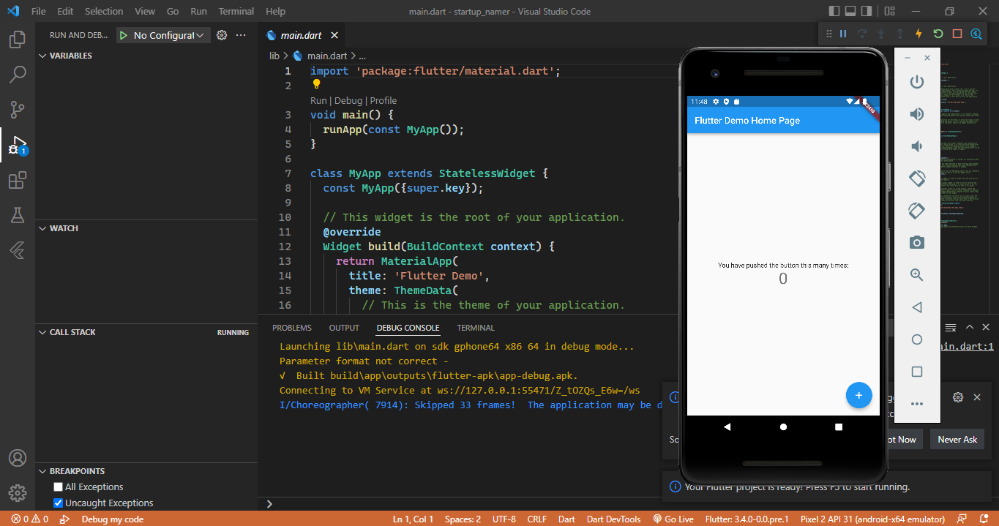
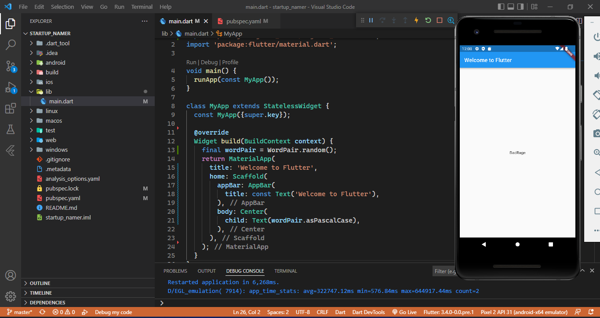
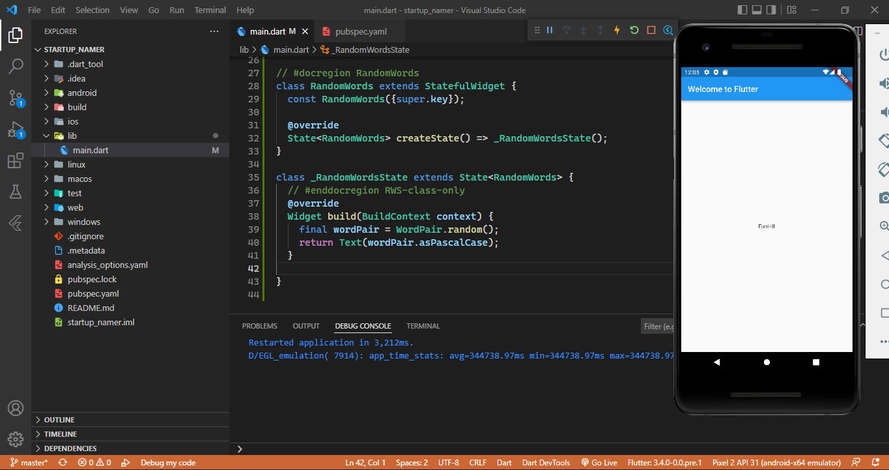
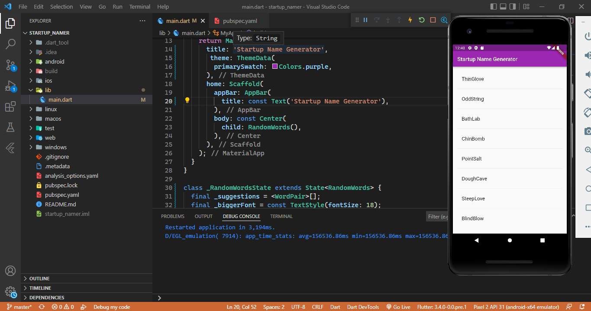
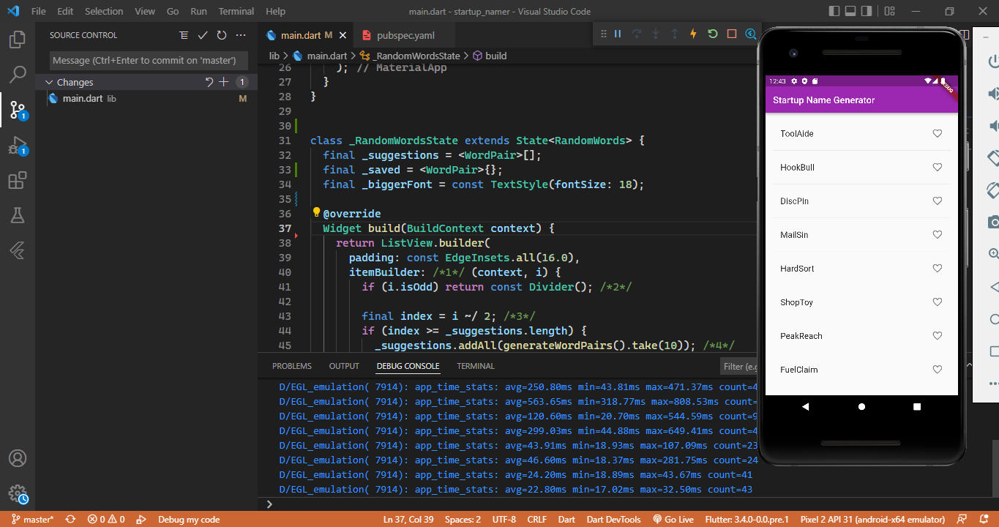

# Flutter External Package & Listview

A new Flutter project.

## Create the starter Flutter app

## Use an external package

## Add a stateful widget

## Create an infinite scrolling ListView

## Add Icons

